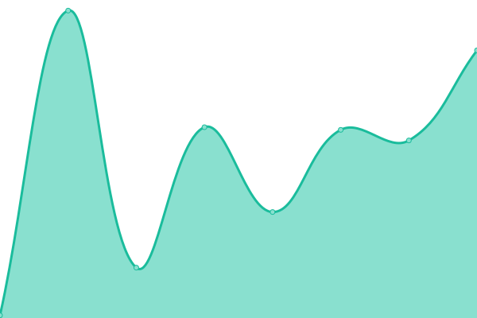
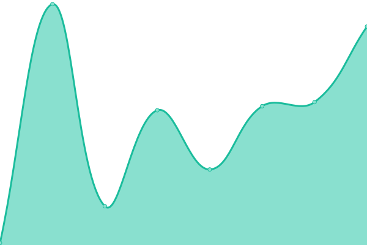
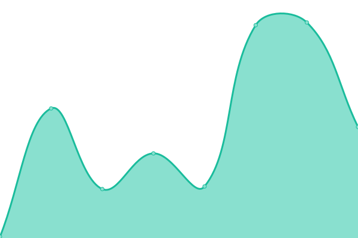

# [Live Status Page ~ REPO](https://Bryan-Herrera-DEV.github.io/status-for-my-web-pages): <!--live status--> **🟩 All systems operational**

Este repositorio contiene el monitor de tiempo de actividad de código abierto y la página de estado de [Bryan Herrera ~ ርᚱ1ናተᛰ ᚻህᚥተპᚱ](https://bryan-herrera.netlify.app/).

<!--start: status pages-->
<!-- This summary is generated by Upptime (https://github.com/upptime/upptime) -->
<!-- Do not edit this manually, your changes will be overwritten -->
<!-- prettier-ignore -->
| URL | Status | History | Response Time | Uptime |
| --- | ------ | ------- | ------------- | ------ |
|  [Bryan Herrera Portfolio](https://bryan-herrera.netlify.app/) | 🟩 Up | [bryan-herrera-portfolio.yml](https://github.com/Bryan-Herrera-DEV/status-for-my-web-pages/commits/HEAD/history/bryan-herrera-portfolio.yml) | 

 228ms
     
 | 

<a href="https://bryan-herrera-dev.github.io/status-for-my-web-pages/history/bryan-herrera-portfolio">100.00%</a>
    

|  [GithubProfile whith Charts](https://bryan-herrera-dev.github.io/Github-Profile-View-With-Charts) | 🟩 Up | [github-profile-whith-charts.yml](https://github.com/Bryan-Herrera-DEV/status-for-my-web-pages/commits/HEAD/history/github-profile-whith-charts.yml) | 

 143ms
     
 | 

<a href="https://bryan-herrera-dev.github.io/status-for-my-web-pages/history/github-profile-whith-charts">100.00%</a>
    

|  [Angular Maps](https://bryan-herrera-dev.github.io/Angular-Maps/) | 🟩 Up | [angular-maps.yml](https://github.com/Bryan-Herrera-DEV/status-for-my-web-pages/commits/HEAD/history/angular-maps.yml) | 

 66ms
     
 | 

<a href="https://bryan-herrera-dev.github.io/status-for-my-web-pages/history/angular-maps">100.00%</a>
    

|  [Pokemon Wiki](https://bryan-herrera-dev.github.io/pokemon-wiki/) | 🟩 Up | [pokemon-wiki.yml](https://github.com/Bryan-Herrera-DEV/status-for-my-web-pages/commits/HEAD/history/pokemon-wiki.yml) | 

 73ms
     
 | 

<a href="https://bryan-herrera-dev.github.io/status-for-my-web-pages/history/pokemon-wiki">100.00%</a>
    

|  [Generator Password](https://bryan-herrera-dev.github.io/Angular-Password-Generator/) | 🟩 Up | [generator-password.yml](https://github.com/Bryan-Herrera-DEV/status-for-my-web-pages/commits/HEAD/history/generator-password.yml) | 

 72ms
     
 | 

<a href="https://bryan-herrera-dev.github.io/status-for-my-web-pages/history/generator-password">100.00%</a>
    

<!--end: status pages-->

Visite mi sitio web de estatus: → [**Aqui**](https://Bryan-Herrera-DEV.github.io/status-for-my-web-pages)

## 📄 License

- Powered by: [Upptime](https://github.com/upptime/upptime)
- Code: [MIT](./LICENSE) © [Bryan Herrera ~ ርᚱ1ናተᛰ ᚻህᚥተპᚱ](https://bryan-herrera.netlify.app/)
