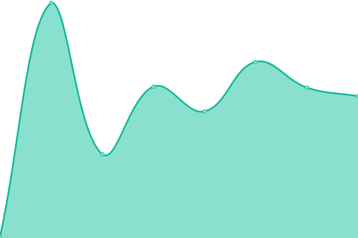

# [Live Status Page ~ REPO](https://Bryan-Herrera-DEV.github.io/status-for-my-web-pages): <!--live status--> **🟩 All systems operational**

Este repositorio contiene el monitor de tiempo de actividad de código abierto y la página de estado de [Bryan Herrera ~ ርᚱ1ናተᛰ ᚻህᚥተპᚱ](https://bryan-herrera.netlify.app/).

With [Upptime](https://upptime.js.org), you can get your own unlimited and free uptime monitor and status page, powered entirely by a GitHub repository. We use [Issues](https://github.com/Bryan-Herrera-DEV/status-for-my-web-pages/issues) as incident reports, [Actions](https://github.com/Bryan-Herrera-DEV/status-for-my-web-pages/actions) as uptime monitors, and [Pages](https://Bryan-Herrera-DEV.github.io/status-for-my-web-pages) for the status page.

<!--start: status pages-->
<!-- This summary is generated by Upptime (https://github.com/upptime/upptime) -->
<!-- Do not edit this manually, your changes will be overwritten -->
<!-- prettier-ignore -->
| URL | Status | History | Response Time | Uptime |
| --- | ------ | ------- | ------------- | ------ |
|  [Bryan Herrera Portfolio](https://bryan-herrera.netlify.app/) | 🟩 Up | [bryan-herrera-portfolio.yml](https://github.com/Bryan-Herrera-DEV/status-for-my-web-pages/commits/HEAD/history/bryan-herrera-portfolio.yml) | 

 310ms
     
 | 

<a href="https://bryan-herrera-dev.github.io/status-for-my-web-pages/history/bryan-herrera-portfolio">100.00%</a>
    

|  [GithubProfile whith Charts](https://bryan-herrera-dev.github.io/Github-Profile-View-With-Charts) | 🟩 Up | [github-profile-whith-charts.yml](https://github.com/Bryan-Herrera-DEV/status-for-my-web-pages/commits/HEAD/history/github-profile-whith-charts.yml) | 

 259ms
     
 | 

<a href="https://bryan-herrera-dev.github.io/status-for-my-web-pages/history/github-profile-whith-charts">100.00%</a>
    

<!--end: status pages-->

[**Visite mi sitio web de estatus: →**](https://Bryan-Herrera-DEV.github.io/status-for-my-web-pages)
Hecho con la tecnologia de: 
 

## 📄 License

- Powered by: [Upptime](https://github.com/upptime/upptime)
- Code: [MIT](./LICENSE) © [Bryan Herrera ~ ርᚱ1ናተᛰ ᚻህᚥተპᚱ](https://bryan-herrera.netlify.app/)
- Data in the `./history` directory: [Open Database License](https://opendatacommons.org/licenses/odbl/1-0/)
